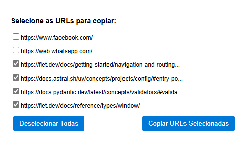

# Lista de URLs

Extensão para o navegadores Chromium Based que permite visualizar, selecionar e copiar rapidamente as URLs de todas as abas abertas.

## 📌 Funcionalidades

* Lista todas as abas abertas no navegador.
* Permite selecionar/deselecionar URLs individualmente.
* Botão para selecionar ou desmarcar todas as URLs.
* Copia as URLs selecionadas para a área de transferência com um clique.

## 🧩 Instalação

1. Baixe ou clone este repositório.
2. Acesse `chrome://extensions/` no navegador Chrome (ou de acordo com o navegador em uso)
3. Ative o **Modo do desenvolvedor** (canto superior direito).
4. Clique em **"Carregar sem compactação"**.
5. Selecione a pasta com os arquivos da extensão.

## 🔒 Permissões

A extensão solicita a permissão:

* `"tabs"` – Necessária para ler as URLs das abas abertas.

## 📷 Captura de Tela

## 🛠️ Tecnologias

* HTML + CSS
* JavaScript (API de extensões do Chrome)

## ✅ Compatibilidade

Compatível com navegadores baseados em Chromium que suportam Manifest V3.

## 📃 Licença

Este projeto está licenciado sob a [MIT License](LICENSE).
